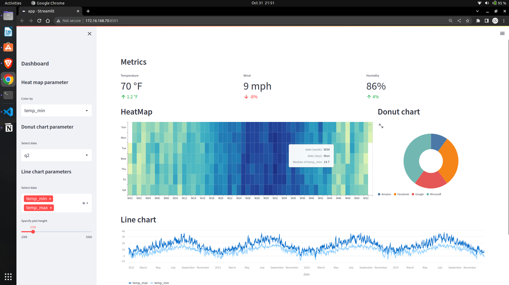

<!-- # Streamlit-Apps

***Url***  ***Shortener***

  

***DashBoard-1***

 

  -->

## About Me 👩‍💻

Hello 👋 

I am Aman Singanamala, Computer Science Student pursuing my Bachelors degree at Vellore Institute of Technology.

#### This is my Portfolio of collection of all Streamlit application I made.

The Streamlit application that are included are:

1. URL Shortener
2. Weather Dashboard
3. Diabeted Predictor
4. Analysis of Google Play Store Application

... more

About the Streamlit apps

## 1. URL Shortener
   - This used the streamlit framework anf PyShortners library to create a URL shortener web application.
   - Overall, this program provides a simple and user-friendly interface for generating shortened URLs using PyShorteners and Streamlit.

## 2. Weather Dashboard
   - This Streamlit application provides the user with several functionalities for exploring and visualizing datasets.
   - The program creates a sidebar that allows the user to customize the parameters for the heatmap, donut chart, and line chart. The user can select which columns to use for coloring the heatmap, selecting data for the donut chart, and choosing which columns to display in the line chart. The user can also customize the height of the line chart.
   - The heatmap displays the median temperature in Seattle for each day of the week over time, while the donut chart shows stock values for various companies. The line chart displays the trend of temperature in Seattle over time.
   - Provides an interactive web interface for visualizing the datasets with various customizable options, making it easy for the user to gain insights and explore data trends in a user-friendly manner.

